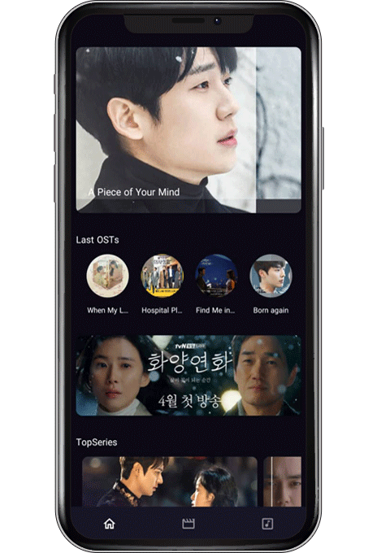
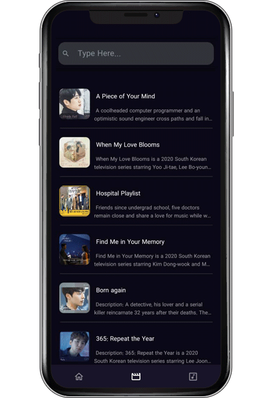
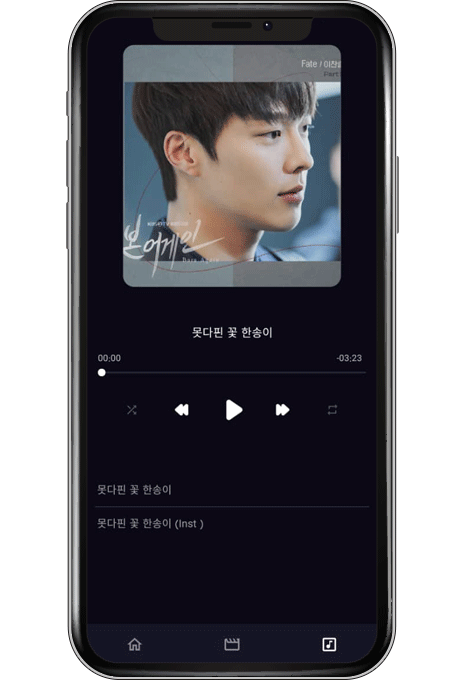

# BeatPod
The react native Online Music Player

#### Features

* Light music player
* Display and manage media controls on lock screen 
* Background activity
* Check the device connection
* Force update

### Api needed

| Api | Type | Description | Required |
| ---  | ---  | ---         | ---      |
| /Version | Array of Strings | Check new update | **YES** |
| /UserInfo | Array of Strings | Send Device info to server (DeviceName,DeviceMode ,SystemName,SystemVersion,UsedMemory) | **YES** |
| /LastAdd | Array of Strings | Return of banner data |  | 
| /MainList | Array of Strings | Return of home data | |

  

